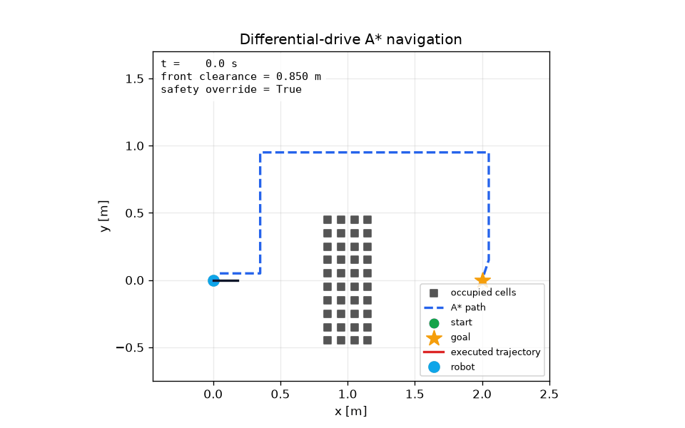
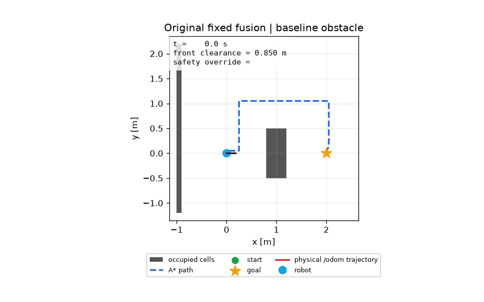
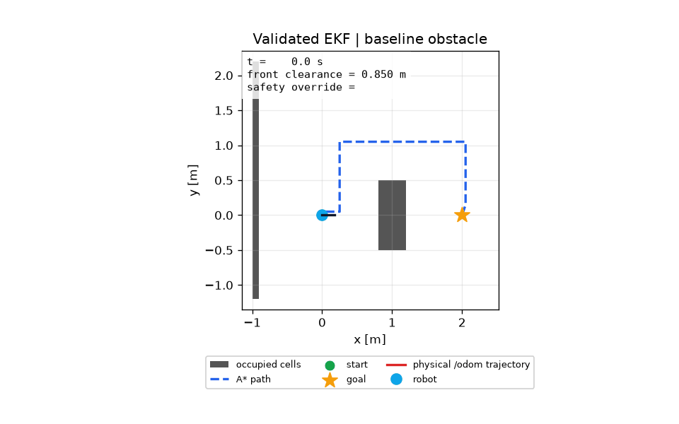
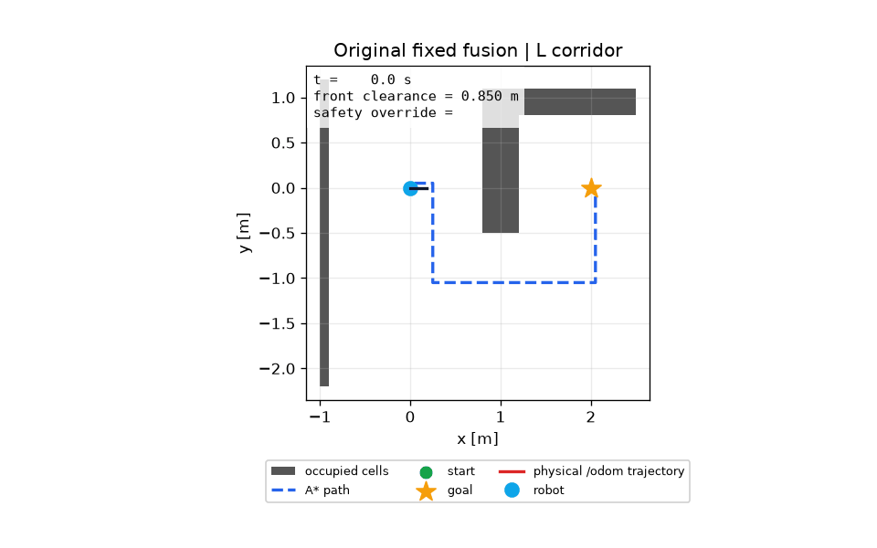
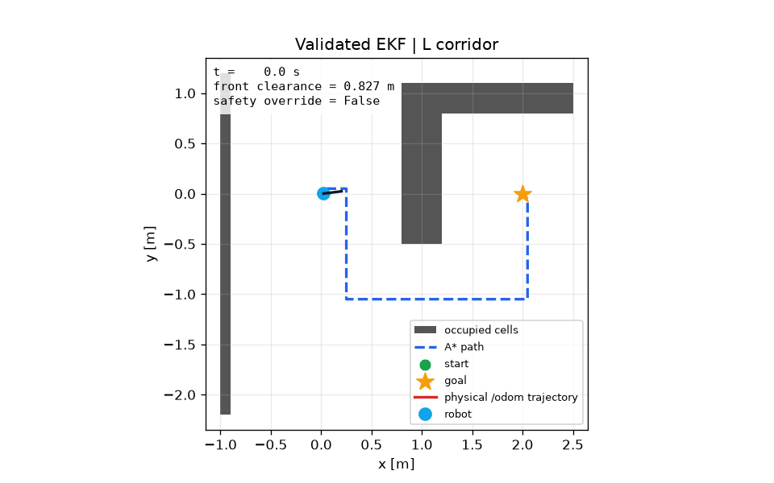
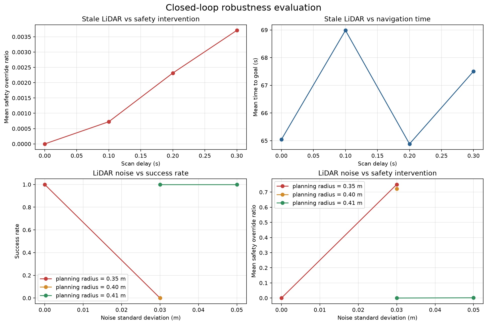

# Classical Path Planning and Sensor-Aware Safety

[](https://github.com/HuijiaoLuo/ros2-planning-and-safety/actions/workflows/ci.yml)

A robotics portfolio project that turns maps and sensor measurements into safe
motion commands for a simulated differential-drive robot.

The repository connects classical grid planning, closed-loop control, LiDAR
safety supervision, wheel/IMU state estimation, and localization diagnostics in
one ROS 2 + Gazebo validation workflow.

<p align="center">
  
</p>

<p align="center"><em>A* planning, path following, and LiDAR-aware safety supervision.</em></p>

## Navigation replay comparison

<table>
  <tr>
    <th>Original fixed fusion</th>
    <th>Validated EKF configuration</th>
  </tr>
  <tr>
    <td></td>
    <td></td>
  </tr>
  <tr>
    <td></td>
    <td></td>
  </tr>
</table>

The left column shows the original detour drift; the right column uses
`fusion_mode:=ekf`, `position_mode:=propagated`, fixed zero gyro bias, and
`wheel_yaw_noise_std_rad:=0.20`. Details and provenance are in
[`docs/assets/README.md`](docs/assets/README.md).

## Status at a glance

| Area | Status |
| --- | --- |
| Grid planning | Python and C++ implementations of DFS, BFS, Dijkstra, Greedy Best-First, and A* |
| ROS 2 baseline | A* path planning, path following, LiDAR safety, and Gazebo simulation are complete |
| Safety validation | Baseline and seeded noise/latency experiments are recorded in `results/` |
| State estimation | Wheel/IMU fusion and covariance-aware EKF are available for diagnostics |
| Localization | Deterministic matching, MCL, and ICP are experimental known-map backends |
| Validation boundary | `/odom` remains the only validated physical navigation reference |

The planning and safety baseline is frozen. State estimation and map
localization are intentionally kept separate from the validated navigation
path until their physical accuracy and timing behavior are established.

## System architecture

```text
/map
  |
  v
global_planner (A*) --> /plan --> path_follower --> /cmd_vel_raw
                                                   |
/scan + /odom --> safety_supervisor --> /cmd_vel --> Gazebo robot
```

The baseline uses `/odom` for navigation. The estimation and localization
workstreams expose separate diagnostic streams:

```text
/wheel_odom + /imu --> /state_prediction --> controller experiments
                                  \
                                   --> /state_estimate

/state_prediction + /scan + /map --> LiDAR/MCL/ICP localization diagnostics
```

`/state_prediction` is the wheel/IMU-only motion prior. Corrected poses are
not currently treated as a validated replacement for `/odom`, and the
known-map localizers are not SLAM systems.

## Current evidence

The current map shows a clear safety margin boundary:

| Configuration | Success | Mean time-to-goal | Mean measured clearance | Safety override ratio |
| --- | :---: | ---: | ---: | ---: |
| Baseline: radius `0.35 m`, no noise | 1/1 | 65.04 s | 0.521 m | 0.000 |
| Noise `0.05 m`, radius `0.41 m` | 3/3 | 70.49 s | 0.632 m | 0.002 |
| Delay `0.30 s` + noise `0.05 m`, radius `0.41 m` | 3/3 | 69.38 s | 0.631 m | 0.008 |

The tested `0.40 m` radius is a boundary case: it required sustained safety
intervention and did not achieve consistent success. These results are
empirical measurements for the current map and seeds, not a map-independent
robustness guarantee.



The first 27-run localization matrix completed without infrastructure failures.
The symmetric corridor reached the physical goal in `9/9` runs, while the
baseline obstacle and L-corridor scenes reached `0/9`; their common
`/state_estimate` drift is about `0.19 m` relative to `/odom`. These results are
diagnostic evidence for the original fixed-fusion configuration. A controlled
v4 run with `ekf + propagated`, fixed zero gyro bias, and `0.20 rad` wheel-yaw
noise reduced the seed-0 state error to `0.016 m` in baseline and `0.048 m` in
the L-corridor, with both runs reaching the goal. The follow-up three-seed
validation completed `6/6` runs successfully, with mean final state errors of
`0.0160 m` and `0.0435 m`. These parameters are now the source defaults for
the wheel/IMU estimator. The visual replay guide is in
[`docs/assets/README.md`](docs/assets/README.md).

## Quick start

### Python planning core

```bash
conda env create -f environment.yml
conda activate robotics-portfolio

python -m robotics_planning.demo
python -m unittest discover -s tests -v
```

Run a small planner benchmark with:

```bash
python tools/planner_scaling_benchmark.py \
  --sizes 20,50 \
  --densities 0,0.1 \
  --seed-count 2
```

### C++ planning core

```bash
cmake -S cpp -B cpp/build
cmake --build cpp/build --config Release
ctest --test-dir cpp/build -C Release --output-on-failure
```

### ROS 2 simulation in WSL2

The simulation uses ROS 2 Jazzy and Gazebo Harmonic:

```bash
cd /mnt/e/HPC_simulation_porfolio/Robotics/ros2_ws
source /opt/ros/jazzy/setup.bash
colcon build --symlink-install
source install/setup.bash
ros2 launch robotics_sim sim.launch.py
```

For a bounded evaluation run:

```bash
ros2 launch robotics_sim sim.launch.py \
  experiment_timeout_s:=120.0 \
  evaluation_output:=/mnt/e/HPC_simulation_porfolio/Robotics/results/robustness_case.csv
```

Select one of the controlled geometry profiles with `scenario`:

```bash
ros2 launch robotics_sim sim.launch.py \
  scenario:=l_corridor \
  experiment_timeout_s:=120.0 \
  evaluation_output:=/mnt/e/HPC_simulation_porfolio/Robotics/results/l_corridor.csv
```

Available profiles are `baseline_obstacle`, `l_corridor`, and
`symmetric_corridor`. The selected profile is recorded in the evaluation CSV
and drives both the Gazebo obstacles and the published `/map`.

To run the first fixed localization matrix from a ROS 2 shell:

```bash
python3 tools/run_localization_matrix.py --dry-run
python3 tools/run_localization_matrix.py
python3 tools/summarize_localization_matrix.py
python3 tools/analyze_localization_drift.py
```

The default matrix contains three scenarios, three localization backends, and
three seeds. Each run writes metrics, diagnostics, and a `*_launch.log` under
`results/localization_matrix/`. The runner only marks a run complete when the
evaluation and estimator files contain samples; a clean ROS exit alone is not
enough. Use `--dry-run` to inspect the commands first, or isolate one smoke
run before the full matrix:

```bash
python3 tools/run_localization_matrix.py \
  --scenarios baseline_obstacle \
  --backends v4 \
  --seeds 0 \
  --output-dir results/smoke_baseline_v4 \
  --stop-on-error
```

If the smoke run is incomplete, inspect its `*_launch.log` and the
`matrix_manifest.csv` failure reason before rerunning the full matrix.

To isolate wheel/state-estimation drift after a detour, compare the two
controlled v4 variants below, then run the drift analyzer on each output:

```bash
python3 tools/run_localization_matrix.py \
  --scenarios baseline_obstacle,l_corridor --backends v4 --seeds 0 \
  --output-dir results/estimator_ab_adaptive_propagated \
  --fusion-mode adaptive --position-mode propagated

python3 tools/run_localization_matrix.py \
  --scenarios baseline_obstacle,l_corridor --backends v4 --seeds 0 \
  --output-dir results/estimator_ab_ekf_propagated \
  --fusion-mode ekf --position-mode propagated

python3 tools/analyze_localization_drift.py \
  --input-dir results/estimator_ab_adaptive_propagated \
  --output-dir results/estimator_ab_adaptive_propagated
python3 tools/analyze_localization_drift.py \
  --input-dir results/estimator_ab_ekf_propagated \
  --output-dir results/estimator_ab_ekf_propagated
```

If EKF still follows wheel yaw, repeat it with
`--gyro-bias-mode fixed --wheel-yaw-noise-std-rad 0.20` to test whether the
detour error is caused by over-trusting wheel yaw.

The complete validation protocol, launch parameters, trace fields, and
diagnostic interpretation are in [`METHOD_TECH.md`](METHOD_TECH.md).

## Repository layout

```text
robotics_planning/     Python planners and benchmarks
cpp/                   C++ planners, demo, and tests
ros2_ws/src/           ROS 2 navigation and simulation packages
tools/                 Evaluation and diagnostic scripts
tests/                 Python unit tests and fixtures
results/               Recorded metrics, traces, and experiment summaries
docs/                  Focused estimation and localization notes
.github/workflows/     GitHub Actions CI
```

## Documentation

- [`METHOD_TECH.md`](METHOD_TECH.md) — system model, equations, ROS graph,
  validation protocol, limitations, and roadmap.
- [`docs/STATE_ESTIMATION.md`](docs/STATE_ESTIMATION.md) — transparent
  wheel/IMU fusion.
- [`docs/POSE_EKF.md`](docs/POSE_EKF.md) — covariance propagation and NIS
  diagnostics.
- [`docs/LOCALIZATION.md`](docs/LOCALIZATION.md) — deterministic LiDAR-map
  matching.
- [`docs/MCL_LOCALIZATION.md`](docs/MCL_LOCALIZATION.md) — known-map Monte
  Carlo localization.
- [`docs/ICP_LOCALIZATION.md`](docs/ICP_LOCALIZATION.md) — point-to-point ICP
  comparison baseline.
- [`docs/COUPLED_ESTIMATION.md`](docs/COUPLED_ESTIMATION.md) — external pose
  updates and estimator/control boundaries.

## Next step

The wheel/state-estimation A/B is now validated across three seeds and has
been promoted to the estimator defaults. Localization gates remain
experimental, and `/odom` remains the validated physical reference.

## License

This project is released under the [Apache License 2.0](LICENSE).
